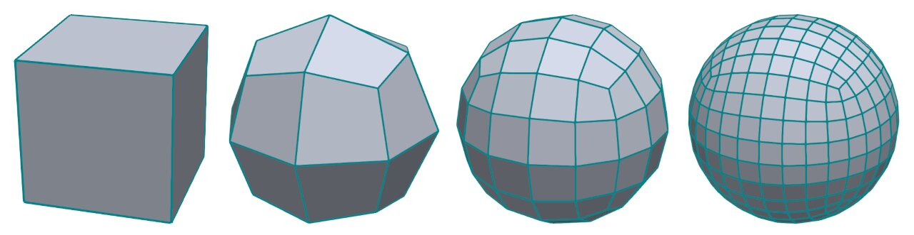
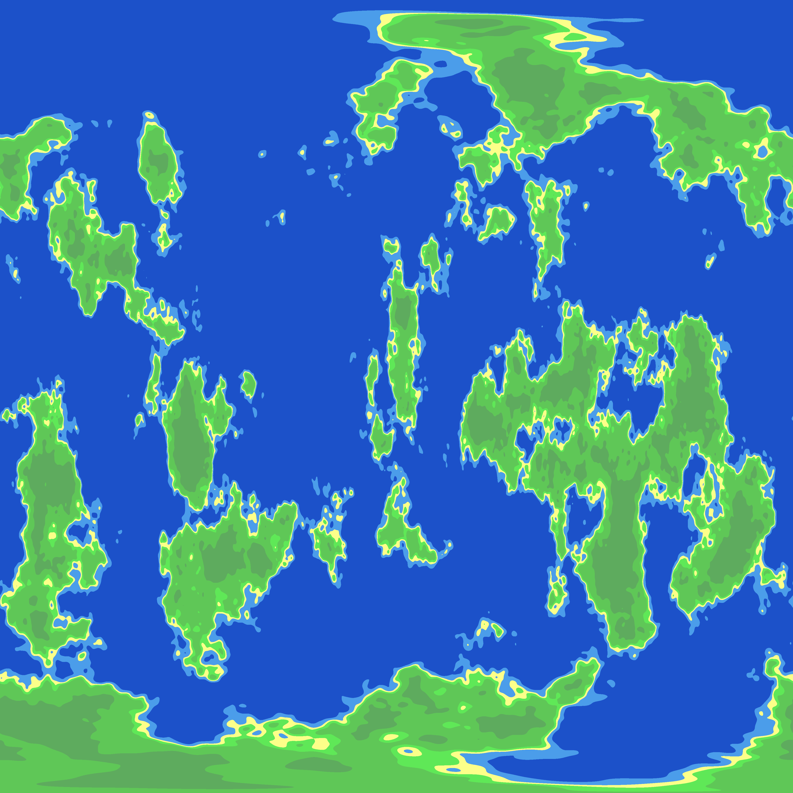

Having an interest procedural content generation and playing Stellaris with friends online, I decided that I, too, want
to generate my own planets. Joakim Larsen has made stuff for Stellaris, and has been a big inspiration in deciding that
I do indeed want to create my own planets. He has a page on ArtStation with some of the planets that I used as a goal
for this project. <a href="https://jlarsen.artstation.com/projects/OJ1GJ">Check out his page for yourself!</a>

I don't have a lot of knowledge about rendering and writing shaders, so, as a year 2 programming student at Buas Games,
I can just do everything on the CPU. How hard can it be, right! Right?

<p align="center">

</p>

# Spheres!
First up, we need a sphere. Planets are generally round, so a sphere is what we need. But what kind of sphere?
<a href="https://danielsieger.com/blog/2021/03/27/generating-spheres.html">Daniel Sieger</a> has a good tutorial on how
to generate different types of spheres. We will be taking a look at just 2 types, the UV sphere and the Quad sphere
(also know the Cube sphere). Let's break the spheres down, and see what type of sphere we need.

### Cube Sphere
<p align="center">

</p>

[Image source](https://danielsieger.com/blog/2021/03/27/generating-spheres.html#the-quad-sphere)

The cube sphere is not really a sphere, but a cube disguised as a sphere. A Cube sphere is a subdivided cube that has
been normalized into a sphere. This makes the sphere easy to work with, since it is based on a grid. We can get, for
example, Simplex Noise on a plane for each side of the cube. Getting things on a plane is a lot easier than on a sphere.

When normalizing the cube, the grid cells toward the center of a plane gets stretched more, thus the cells in the center
are larger than the cells near the edges of the cube. We can try to apply a tangent adjustment to fix the problem
somewhat. This can be shown in <a href="https://www.redblobgames.com/x/1938-square-tiling-of-sphere/#appendix"> an
article from redblobgames</a> on the topic. Without the adjustment, you may find that the center of the planes may
be warping the textures and such. Since there are no "poles" on a cube sphere, there is no pinching of a texture that a
UV sphere normally suffers from.

If you want to have a highly detailed planet which you could potentially land on, you don't want to render the entire
planet in high detail. Using the grid system on the Cube sphere, it's possible to only render the grid cells (chunks)
that are within view in higher detail (LOD).

### UV Sphere
<p align="center">

</p>

[Image source](https://danielsieger.com/blog/2021/03/27/generating-spheres.html#the-uv-sphere)

Since I want my planets to be similar to those of Stellaris, I don't actually need all the pros that the Cube sphere
provides since I will be viewing the planets from further away, and not from super close by. So the most common and
simplest form of a sphere, a UV sphere, will be enough for my use case. But there is one problem that the uv sphere has,
that the cube sphere does not have; The UV sphere has poles... and that means texture pinching!

<p align="center">

</p>

# Texture Generation
To fix the pinching of the UV sphere, we're not going to be warping the UV sphere to eliminate the pinching. Instead,
we're going to bake the warping into the texture so that, when we apply the texture, the texture looks like normal on
the sphere with no warping or pinching!

A texture or image with the warping baked into the image itself, is called an equirectangular map. The world map on
your classroom wall is also an example of an equirectangular map. This makes countries closer towards the poles, like
russia, look a lot bigger on the map then they in actuality are. Check out <a href="https://www.thetruesize.com/">
https://www.thetruesize.com/</a> to see how the warping affects countries on a map!

<p align="center">

</p>

### Spherical coordinates
The idea is to get the coordinates of points on the sphere in 3D space. Using these coordinates we can get noise values
from a 3D noise algorithm and use that to generate a texture. Because these points are denser towards the poles of the
sphere, we get duplicate noise values, or at least similar values so that we get a warped look around the poles as seen
in the texture image above.

Here is how we calculate the spherical coordinates based on the texture resolution. The textures I generate are always
square so the resolution parameter in this example is the same for the width and height. A good resolution could
be 1024.
```c++
std::vector<float> coordinates(resolution * resolution * 3);

for (int y = 0; y < resolution; y++)
{
    for (int x = 0; x < resolution; x++)
    {
        // Map x, y to [-1, 1] range
        const float u = 2.0f * (((float)x / (float)resolution) - 0.5f);
        float v = 2.0f * (((float)y / (float)resolution) - 0.5f);
        v = 1.0f - v;
        
        // Convert u, v to spherical coordinates
        const float theta = u * glm::pi<float>();
        const float phi = (v * glm::half_pi<float>()) - glm::half_pi<float>();

        // Convert spherical coordinates to Cartesian coordinates
        const int index = y * resolution + x;
        coordinates[index + 0] = cos(phi) * cos(theta); // X
        coordinates[index + 1] = cos(phi) * sin(theta); // Y
        coordinates[index + 2] = sin(phi);              // Z
    }
}
```
Now that we have the coordinates that we need to start generating noise values. This can be done from any noise library,
or your own custom noise algorithm. With these noise values we will be generating the albedo texture, metallic/roughness
texture, the normal texture, and, in some cases, and emissive texture.

### Noise
Out first goal is to generate a terrain that somewhat resembles that of an earth-like (gaia) planet. There are many ways
to achieve this. One example is using voronoi to generate the continents and work from there as shown in this series on
frozen fractal: <a href="https://frozenfractal.com/blog/2023/11/2/around-the-world-1-continents/">Around the world</a>.

But the easiest way to get something like planets is to use perlin or simplex noise. For this project I used the
<a href="https://github.com/Auburn/FastNoise2">FastNoise2 noise library</a>. The result should be a vector or array of
float values. each float value is normally a value between -1 and 1, we can normalize these values to be between 0 and
1 so that they are easier to work with.

```c++
// FastNoise2 noise setup
auto fnSimplex = FastNoise::New<FastNoise::Simplex>();
auto fnFractal = FastNoise::New<FastNoise::FractalFBm>();
fnFractal->SetSource(fnSimplex);
fnFractal->SetGain(0.650f);
fnFractal->SetWeightedStrength(0.500f);
fnFractal->SetOctaveCount(4);
fnFractal->SetLacunarity(2.500);
auto fnScale = FastNoise::New<FastNoise::DomainScale>();
fnScale->SetSource(fnFractal);
fnScale->SetScale(0.8f);

// We divide the coordinate size by 3 since we
// have a single noise value for each x, y, and z value
std::vector<float> noise(coordinates.size() / 3);
for (size_t i = 0; i < coordinates.size() / 3; i++)
{
    float x = coordinates[i * 3 + 0];
    float y = coordinates[i * 3 + 1];
    float z = coordinates[i * 3 + 2];
    
    noise[i] = fnScale->GenSingle3D(x, y, z, seed);
}
```

### Albedo texture
When generating an albedo or base color texture, the color value components are saved between 0 and 255, an unsigned
char. A color can have 3 or 4 components depending on if you want to have an alpha channel for transparency. The
simplest texture we can generate is a black-and-white texture. we don't have to do any color mapping for that.

```c++
std::vector<unsigned char> albedo(terrain->resolution * terrain->resolution * 4);
for (size_t i = 0; i < noise.size(); i++)
{
    albedo[i * 4 + 0] = (unsigned char)(255.f * noise[i]);
    albedo[i * 4 + 1] = (unsigned char)(255.f * noise[i]);
    albedo[i * 4 + 2] = (unsigned char)(255.f * noise[i]);
    albedo[i * 4 + 3] = 255;
}

stbi_write_png("albedo_monochrome.png", resolution, resolution, 4, albedo.data(), resolution * 4);

```
This example shows how we can write the noise values to a file in black and white colors. We could simply do some checks
for the noise/height value to assign colors, but that would result in some sharp edges for the colors. It's a lot nicer
looking (and less stylized) to have some color blending.

```c++
std::vector<std::pair<float, glm::vec3>> colors = {
    {0.495f,{0.110,0.318,0.792}},    // Deep water
    {0.540f,{0.714,0.890,0.859}},    // Shallow water
    {0.570f,{0.898,0.851,0.761}},    // Sand
    {0.610f,{0.447,0.329,0.157}},    // Grass
    {0.650f,{0.710,0.729,0.380}},    // Forest
    {1.000f,{0.486,0.553,0.298}},    // Darker forest
};

glm::vec3 LerpColor(glm::vec3 a, glm::vec3 b, float t)
{
    return {
        glm::lerp(a.r, b.r, t),
        glm::lerp(a.g, b.g, t),
        glm::lerp(a.b, b.b, t),
    };
}

glm::vec3 GetColorByHeight(float height)
{
    // Assumes the color array is never empty
    for (size_t i = 0; i < terrainColorPalette.size() - 1; i++)
    {
        if (height < terrainColorPalette[i + 1].first)
        {
            float t = (height - terrainColorPalette[i].first) / (terrainColorPalette[i + 1].first - terrainColorPalette[i].first);
            return LerpColor(terrainColorPalette[i].second, terrainColorPalette[i + 1].second, t);
        }
    }

    return terrainColorPalette.back().second; // If we've gone past the last gradient stop, return the last color
}
```

We have a color palette with data a "max appearance" value and a color value. We can now use these functions to extend
the code to generate an albedo texture that contains color that blend with each other.

```c++
std::vector<unsigned char> albedo(terrain->resolution * terrain->resolution * 4);
for (size_t i = 0; i < noise.size(); i++)
{
    auto color = GetColorByHeight(noise[i]);
    albedo[i * 4 + 0] = (unsigned char)(255.f * color.r);   // R
    albedo[i * 4 + 1] = (unsigned char)(255.f * color.g);   // G
    albedo[i * 4 + 2] = (unsigned char)(255.f * color.b);   // B
    albedo[i * 4 + 3] = 255;                                // A, always fully opaque
}

stbi_write_png("albedo_colored.png", resolution, resolution, 4, albedo.data(), resolution * 4);
```
# Clouds
A planet needs clouds, and here are multiple ways to get clouds. In 3D games, the world often has volumetric clouds.
But this isn't really applicable to my use case. There is also the possibility of using satellite cloud data, you can
download some cloud maps from the <a href="https://visibleearth.nasa.gov/images/57747/blue-marble-clouds">NASA website
</a> or from <a href="https://www.shadedrelief.com/natural3/pages/clouds.html">ShadedRelief</a>. Satellite data isn't
something I would call procedurally generated. So what options do we have left to generate some clouds?

Clouds are similar to a fluid in terms of simulation. Curl noise is an algorithm based on the OpenSimplex2 noise
algorithm that moves the points of the noise in a fluid-like turbulent motion. <a href="https://www.reddit.com/r/proceduralgeneration/comments/11wyknt/procedural_generation_of_global_cloud_cover/">
The Reddit user u/wedesoft has got some good results from using curl noise</a> for generating an image that looks somewhat like
clouds. You can read more about curl-noise in <a href="https://www.cs.ubc.ca/~rbridson/docs/bridson-siggraph2007-curlnoise.pdf">
this paper</a> and play around in <a href="https://al-ro.github.io/projects/curl/">this visualizer</a>.

But curl noise needs multiple passes in order to generate this cloud-like look, and since I am doing everything on the
CPU, it would take too much time to generate a single cloud texture for a single planet. Especially if you want multiple
planets rendered at the same time.

<p align="center">

</p>

[Image source](https://www.researchgate.net/figure/Random-noise-flowfield-left-and-Curl-noise-right-Line-integral-convolution-is-used_fig2_225841789)

So it's back to using regular noise. After playing around with the noise library and seeing what works. There were 2
results that I liked that looked realistically enough like clouds to me, densely clouded, and sparsely clouded.

Densely clouded:

<p align="center">

</p>

```c++
auto fnSimplex2 = FastNoise::New<FastNoise::OpenSimplex2>();
auto fnFractal = FastNoise::New<FastNoise::FractalFBm>();
fnFractal->SetSource(fnSimplex2);
fnFractal->SetGain(0.500f);
fnFractal->SetWeightedStrength(0.000f);
fnFractal->SetOctaveCount(3);
fnFractal->SetLacunarity(2.000);
auto fnFractal2 = FastNoise::New<FastNoise::FractalFBm>();
fnFractal2->SetSource(fnFractal);
fnFractal2->SetGain(0.500f);
fnFractal2->SetWeightedStrength(0.000f);
fnFractal2->SetOctaveCount(3);
fnFractal2->SetLacunarity(2.000);
auto fnFractal3 = FastNoise::New<FastNoise::FractalFBm>();
fnFractal3->SetSource(fnFractal2);
fnFractal3->SetGain(0.500f);
fnFractal3->SetWeightedStrength(0.000f);
fnFractal3->SetOctaveCount(3);
fnFractal3->SetLacunarity(2.000);
auto fnScale = FastNoise::New<FastNoise::DomainScale>();
fnScale->SetSource(fnFractal3);
fnScale->SetScale(1.0f);

// Normalize noise values between 0 and 1
// Set transparency of pixel per value to 255 * noise_value
```

and sparsely clouded:

<p align="center">

</p>

```c++
const auto fnSimplex2 = FastNoise::New<FastNoise::OpenSimplex2>();
const auto fnFractal = FastNoise::New<FastNoise::FractalRidged>();
fnFractal->SetSource(fnSimplex2);
fnFractal->SetGain(0.500f);
fnFractal->SetWeightedStrength(0.000f);
fnFractal->SetOctaveCount(5);
fnFractal->SetLacunarity(2.000);
const auto fnOffset = FastNoise::New<FastNoise::DomainOffset>();
fnOffset->SetSource(fnFractal);
fnOffset->SetOffset<FastNoise::Dim::X>(position.x);
fnOffset->SetOffset<FastNoise::Dim::Y>(position.y);
fnOffset->SetOffset<FastNoise::Dim::Z>(position.z);
const auto fnDomainWarp = FastNoise::New<FastNoise::DomainWarpGradient>();
fnDomainWarp->SetSource(fnOffset);
fnDomainWarp->SetWarpAmplitude(1.160f);
fnDomainWarp->SetWarpFrequency(0.720f);
const auto fnTerrace = FastNoise::New<FastNoise::Terrace>();
fnTerrace->SetSource(fnDomainWarp);
fnTerrace->SetMultiplier(1.0f);
fnTerrace->SetSmoothness(1.220f);
const auto fnScale = FastNoise::New<FastNoise::DomainScale>();
fnScale->SetSource(fnTerrace);
fnScale->SetScale(1.2f);

// Set transparency of pixel per value to 255 * noise_value
```

By using 4D noise, we can also shift through the 4th dimension so get the clouds to "flow", but this would require one
to generate a new texture every frame, or generate a loop beforehand that can then be played. But here is what it would
look like by generating a texture every frame.

<p align="center">

</p>

# Normal Map
Normal mapping is a technique used for faking lighting of bumps and dents this giving the illusion that an object has
height or depth. This technique is commonly used for walls and floors, and to add details back into a simplified mesh.

<p align="center">

</p>

[Image source](https://learnopengl.com/Advanced-Lighting/Normal-Mapping)

We can generate a normal map from a height map using the sobel operator. But we don't have a height map, right? All we
have is the noise values. And we created a monochrome texture from that data before, that our height map. So each value
from our noise data maps directly to what would be a pixel in a texture. The normal map generation I am currently using
is "good enough" but there are better options out there, that don't necessarily use the sobel operator. <a href="https://en.wikipedia.org/wiki/Normal_mapping">
This wikipedia page has a good read on normal mapping</a>.

<p align="center">

</p>

```c++
int height = resolution;
int width = resolution;
float strength = 3.f;

for (int y = 0; y < height; ++y)
{
    for (int x = 0; x < width; ++x)
    {
        float tl = (noise[((y - 1 + height) % height) * width + ((x - 1 + width) % width)] + 1.0f) * 0.5f; //top left
        float t = (noise[((y - 1 + height) % height) * width + (x)] + 1.0f) * 0.5f; //top center
        float tr = (noise[((y - 1 + height) % height) * width + ((x + 1) % width)] + 1.0f) * 0.5f; //top right
    
        float l = (noise[(y) * width + ((x - 1 + width) % width)] + 1.0f) * 0.5f;// center left
        float r = (noise[(y) * width + ((x + 1) % width)] + 1.0f) * 0.5f; //center right
    
        float bl = (noise[((y + 1) % height) * width + ((x - 1 + width) % width)] + 1.0f) * 0.5f; //bottom left
        float b = (noise[((y + 1) % height) * width + (x)] + 1.0f) * 0.5f; //bottom center
        float br = (noise[((y + 1) % height) * width + ((x + 1) % width)] + 1.0f) * 0.5f; //bottom right
    
        float dX = -((tr + 2.0f * r + br) - (tl + 2.0f * l + bl));
        float dY = -((bl + 2.0f * b + br) - (tl + 2.0f * t + tr));
    
        float dZ = 1.0f / strength;
        float len = sqrtf(dX * dX + dY * dY + dZ * dZ);
        dX /= len;
        dY /= len;
    
        int index = (y * width + x) * 4;
        normal[index + 0] = (unsigned char)((dX * 0.5f + 0.5f) * 255.f);
        normal[index + 1] = (unsigned char)((dY * 0.5f + 0.5f) * 255.f);
        normal[index + 2] = 255;
        normal[index + 3] = 255;
    }
}
```
# Conclusion
I hope this has given you a step in the right direction by clearing some things up, that might have been a mystery before.
There are a lot of ways you can go about generating a planet depending on your needs. There are multiple sources on this
topic, with each a different approach. Check what requirements your planets have, and find an approach that fits those
requirements! I will list some sources that have a different approach from what I have done.

- <a href="https://www.youtube.com/watch?v=lctXaT9pxA0">Sebastian Lague - Coding Adventure: Procedural Moons and Planets</a><br/>
- <a href="https://frozenfractal.com/blog/2023/11/2/around-the-world-1-continents/">Thomas ten Cate - Around The World</a><br/>
- <a href="https://www.cs.cmu.edu/~ajw/s2007/0251-SphericalWorlds.pdf">EA - Creating spherical words for Spore</a><br/>
- <a href="https://acko.net/blog/making-worlds-1-of-spheres-and-cubes/">Steven Wittens - Making worlds</a><br/>

<p align="center">

</p>

# Further reading
### Atmosphere
You may have noticed that the planets are missing something. Yes, they're missing an atmosphere like our own blue marble.
There are multiple ways to fake this, such as having a disc that fades out behind the planet, or adding another sphere
on top of the terrain and clouds we already have, and adding a fading color on a texture for that sphere that just
reaches over the edges of the planet, facing away from the camera at all times.

Or you can add in an actual atmosphere! This approach would be GPU based, but it definitely will get some good results.
It may be an entire project on its own, so thread carefully before starting on recreating a realistic atmosphere.

<a href="https://www.alanzucconi.com/2017/10/10/atmospheric-scattering-3/">Alan Zucconi - Atmospheric Scattering Pt.3</a><br/>

### Sources
- [https://danielsieger.com/blog/2021/03/27/generating-spheres.html](https://danielsieger.com/blog/2021/03/27/generating-spheres.html)<br/>
- [https://jlarsen.artstation.com/projects/OJ1GJ](https://jlarsen.artstation.com/projects/OJ1GJ)<br/>
- [https://www.redblobgames.com/x/1938-square-tiling-of-sphere/](https://www.redblobgames.com/x/1938-square-tiling-of-sphere/)<br/>
- [https://frozenfractal.com/blog/2023/11/2/around-the-world-1-continents/](https://frozenfractal.com/blog/2023/11/2/around-the-world-1-continents/)<br/>
- [https://github.com/Auburn/FastNoise2](https://github.com/Auburn/FastNoise2)<br/>
- [https://visibleearth.nasa.gov/images/57747/blue-marble-clouds](https://visibleearth.nasa.gov/images/57747/blue-marble-clouds)<br/>
- [https://www.shadedrelief.com/natural3/pages/clouds.html](https://www.shadedrelief.com/natural3/pages/clouds.html)<br/>
- [https://www.cs.ubc.ca/~rbridson/docs/bridson-siggraph2007-curlnoise.pdf](https://www.cs.ubc.ca/~rbridson/docs/bridson-siggraph2007-curlnoise.pdf)<br/>
- [https://al-ro.github.io/projects/curl/](https://al-ro.github.io/projects/curl/)<br/>
- [https://learnopengl.com/Advanced-Lighting/Normal-Mapping](https://learnopengl.com/Advanced-Lighting/Normal-Mapping)<br/>
- [https://www.youtube.com/watch?v=lctXaT9pxA0](https://www.youtube.com/watch?v=lctXaT9pxA0)<br/>
- [https://frozenfractal.com/blog/2023/11/2/around-the-world-1-continents/](https://frozenfractal.com/blog/2023/11/2/around-the-world-1-continents/)<br/>
- [https://www.cs.cmu.edu/~ajw/s2007/0251-SphericalWorlds.pdf](https://www.cs.cmu.edu/~ajw/s2007/0251-SphericalWorlds.pdf)<br/>
- [https://acko.net/blog/making-worlds-1-of-spheres-and-cubes/](https://acko.net/blog/making-worlds-1-of-spheres-and-cubes/)<br/>
- [https://www.alanzucconi.com/2017/10/10/atmospheric-scattering-3/](https://www.alanzucconi.com/2017/10/10/atmospheric-scattering-3/)

<hr/>
<p align="center">

</p>